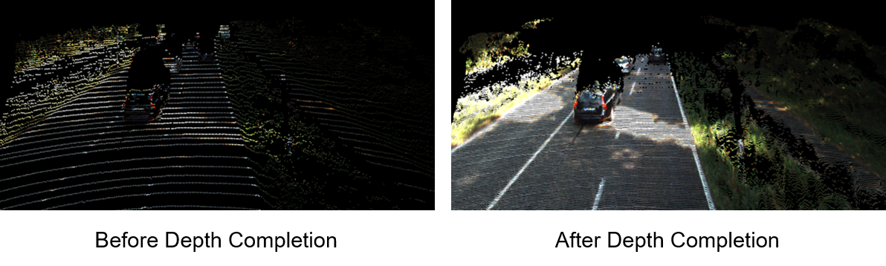

# Multi-Modal Deep Aggregation Network for Depth Completion

This is the official PyTorch implementation of MDANet (ICRA 2021), an efficient network for depth completion.



## Introduction

Depth completion aims to recover the dense depth map from sparse depth data and RGB image respectively. However, due to the huge difference between the multi-modal signal input, vanilla convolutional neural network and simple fusion strategy cannot extract features from sparse data and aggregate multi-modal information effectively. To tackle this problem, we design a novel network architecture that takes full advantage of multi-modal features for depth completion. An effective Pre-completion algorithm is first put forward to increase the density of the input depth map and to provide distribution priors. Moreover, to effectively fuse the image features and the depth features, we propose a multi-modal deep aggregation block that consists of multiple connection and aggregation pathways for deeper fusion. Furthermore, based on the intuition that semantic image features are beneficial for accurate contour, we introduce the deformable guided fusion layer to guide the generation of the dense depth map. The resulting architecture, called MDANet, outperforms all the state-of-the-art methods on the popular KITTI Depth Completion Benchmark, meanwhile with fewer parameters than recent methods. 

## Dependency

### Requirements

All the codes are tested in the following environment:

- Ubuntu 16.04
- Python 3.7
- PyTorch 1.5.0
- Torchvision 0.4.1
- NVIDIA CUDA 10.1.105
- mmcv 1.0.5 (You can install mmcv from this [repo](https://github.com/open-mmlab/mmcv))

```bash
pip install glob
pip install pillow
pip install tqdm
pip install opencv-python
```

The models reported in paper are trained with 8 *NVIDIA Tesla P100* (16G) GPUs with batch-size 16. Please note your GPU memory.

### Installation

a. clone this repository

```bash
git clone https://github.com/USTC-Keyanjie/MDANet_ICRA2021.git && cd MDANet_ICRA2021
```

b. download our trained weight file

You could download the pretrained model of MDANet from [Google Drive](https://drive.google.com/file/d/1BV08KU-KVndhl0sw-4hzvOw95eW6Ik6F/view?usp=sharing) or [BaiduYun](https://pan.baidu.com/s/1Q7jY3AwUp0vXXsowIqKaeQ)(Password: m3eb).

c. move it to checkpoints folder

```bash
mv net-best.pth.tar results/quickstart/checkpoints/
```

### Dataset preparation

Download the official [KITTI Depth](http://www.cvlibs.net/datasets/kitti/eval_depth.php?benchmark=depth_completion) dataset and [KITTI Raw](http://www.cvlibs.net/datasets/kitti/raw_data.php) dataset, and then organize the downloaded files as follows:

```
/path/to/KITTI/Depth/dataset
├── data_depth_annotated
│   ├── train
│   └── val
├── data_depth_velodyne
│   ├── train
│   └── val
└── depth_selection
    ├── test_depth_completion_anonymous
    ├── test_depth_prediction_anonymous
    └── val_selection_cropped
```

```
/path/to/KITTI/Raw/dataset
├── 2011_09_26
│   ├── 2011_09_26_drive_0001_sync
│   └── ...
├── 2011_09_28
│   ├── 2011_09_28_drive_0001_sync
│   └── ...
├── 2011_09_29
│   ├── 2011_09_29_drive_0004_sync
│   └── ...
├── 2011_09_30
│   ├── 2011_09_30_drive_0016_sync
│   └── ...
└── 2011_10_03
    ├── 2011_10_03_drive_0027_sync
    └── ...
```

## Quick start

a. modify the config file (default config file is `config\default.json`)

**Note**: you must specify the `dataset_dir`  and `rgb_dir` as `/path/to/KITTI/Depth/dataset` and `/path/to/KITTI/Raw/dataset` separately.

b. run the code

```bash
python run_eval.py --config default --set test --ckpt results/quickstart/checkpoints/net-best.pth.tar
```

You can also save the output by attaching `--save_output` to the above command. The evaluation report will be saved in the `eval.log` file after the program runs.

## Train

```bash
python train.py --config default
```

The train report will be saved in the `train.log` file after the training.

## Inference

a. infer single model

```bash
python run_eval.py --config default --set selval --ckpt results/<your/train/dir>/checkpoints/<model_name>.pth.tar
```

b. infer multiple model

You can infer multiple model by specifying the `ckpt` to a folder. For example:

```bash
python run_eval.py --config default --set selval --ckpt results/<your/train/dir>/checkpoints
```

The evaluation report will be saved in the `eval_folder.log` file after the program runs.


